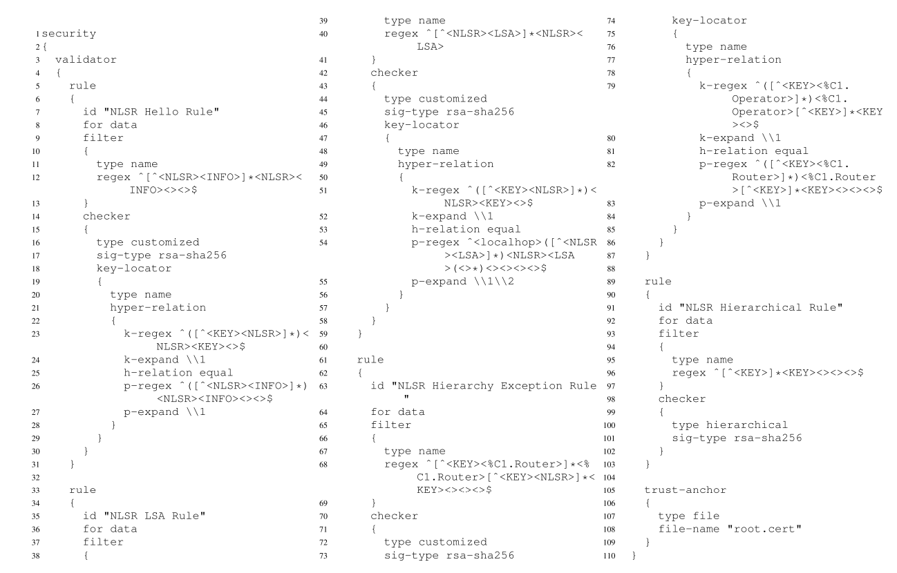
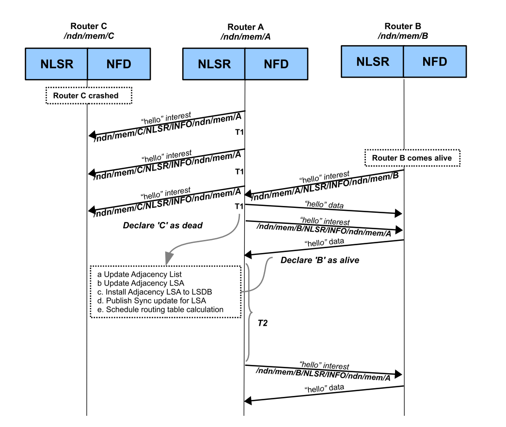

# 一种用于NDN的安全的链路状态路由协议

> 原文地址：[A Secure Link State Routing Protocol for NDN](https://github.com/SunnyQjm/ndn-paper-translation/raw/master/original_paper/nlsr_a_secure_link_state_routing_protocol_for_ndn_2018.pdf)

## 摘要（Abstract）

命名数据链路状态路由协议（NLSR，*Named-data Link State Routing protocol*）是一个用作NDN网络域内路由的协议。很很多IP网络下的路由协议一样，它也是一个应用层的协议，不同的是NLSR使用NDN的兴趣包和数据包来更新路由信息，直接受益于NDN内建的数据认证机制。NLSR的设计首次于2013年开始开发，并在2014年八月第一次部署在NDN测试床上，在此期间NLSR的设计经历了巨大的变化。遵循应用程序驱动的设计方法，NLSR的开发同时推动了NDN库（*NDN libraries*）信任（*trust*）和安全（security）功能的开发，以及NDN的转发守护进程和 *ChronoSync* 中许多特性的支持。在本文中，我们将介绍NLSR当前的设计和实现，与基于IP的路由协议相比主要有以下几点主要区别：

- 命名方式（*naming*）：NLSR使用一个适用于路由器、安全密码（*keys，包括公私钥那些*）、和路由更新的层次化命名方案；
- 安全（*security*）：NLSR使用一个适用于单个管理域的层次化信任模型；
- 路由信息分发（*routing information dissemination*）：NLSR使用 *ChronoSync* 来传送路由更新；
- 多路径路由（*multipath routing*）：NLSR使用一个给多路径转发选项排序的简单算法。

虽然NLSR是作为单一域下的路由协议被设计的，但它的设计模式可以为未来开发域间路由协议提供有用的参考。

> 术语索引（*Index terms*）：路由协议（*Routing protocols*），下一代网络（*next generation network*），计算机安全（*computer security*）

## 介绍（Introduction）

命名数据网络（*NDN*）`[1,2,3]` 是一种以内容为中心的网络架构，用来解决TCP/IP网络中的网络使用和未解决的问题。NDN颠覆了传统的“把数据包从一个终端传输到另一个终端的”网络服务模型，它采用“拉取命名数据”的网络模型。通过显示的给数据包命名和签名，并维护有状态的转发平面 [4]，NDN提供了一些现有的IP网络很难实现的功能特性，例如：网内缓存（*in-network caching*），多播交付（*multicast delivery*），多路径转发（*multi-path forwarding*）和数据跟踪（*data provenance*）。

一个NDN的路由协议主要有两个功能，传播路由更新以及计算到命名前缀（*name prefix*）的路由。由于NDN采用层次化命名方案，并且NDN的转发语义是IP的一个超集（*虽然不太合理，但是如果NDN采用点分十进制给数据进行命名，并且使用单路径路由，那么NDN路由转发的语义和 IP下的类似了*），所以NDN可以使用IP下的任何路由算法来计算最佳路径（*best route*），例如：链路状态路由算法（*link-state routing protocol*）或距离向量路由算法（*distance-vector routing protocol* ）。然而，一个NDN的路由协议需要为数据包的转发提供多个下一跳，并以此来支持NDN的多路径转发（*multipath forwarding*），其中包括通向一个数据生产者（*data producer*）的多条路径和通向多个数据生产者的路径（两种方式在前缀可达性语义上存在差异，需要在路由协议设计中加以考虑，参见 `[1, 4.1节]` 以及本文的2.3节）。此外，NDN路由协议需要传播命名前缀而不是IP地址前缀的可达性信息，更重要的是需要用NDN的兴趣包和数据包而不是IP数据包来交换路由信息，这样做能使得路由协议受益于NDN内建的数据验证的能力。

这篇文章主要介绍了NLSR的设计和实现，它是一个用于NDN的路由协议。自我们在2013年粗略的描述出NLSR的初版设计 `[5]` 算起，该设计经历过大量的修改。在过去的四年里，我们通过实际的开发部署（*real implementations*）和实验测量（*experimentation*），对NDN和NDN应用程序的开发方法有了更深入的了解。本文的目标是论证使用NDN来实现路由协议的可行性和好处，并与整个社区分享我们的经验和观察。

NLSR与基于IP的链路状态路由协议相比主要有以下几点不同：

- ### 命名（Naming）

  NLSR使用层次结构的名称来标识路由器、路由进程、路由数据和密钥，因为他们之间的关系本质上是层次结构的。这种设计方式便于实现路由安全（*具体实现参见下文*），而且还允许NLSR使用所有类型的通信通道（*communication channel*），例如：它可以以同样的方式使用以太网、IP、TCP/UDP通道，因为它不依赖于特定类型的地址。相反，基于IP的链路状态路由协议（*如 OSPF [6]* ）通常使用一个地址作为标识符，例如IP地址。这种方式存在几个弊端，首先，它引入了对特定类型地址的依赖，这些地址通常嵌入在路由器的配置和其它管理功能中；其次，标识符是不稳定的，即它会随着位置的改变而改变；第三，标识符缺少上下文信息，而上下文对管理和安全都是很重要的。此外，这些协议没有显示的命名路由进程、路由数据和密钥，如果没有给这些实体和关系赋予有意义的名字，则很难监视路由系统并诊断它的问题。

- ### 安全（Security）

  由于每个NLSR路由信息都是由一个包含签名的NDN数据包所携带的，因此路由器可以验证每个路由消息的签名，以保证它是由它所声明的源路由器产生的，并且在传输的过程中没有被篡改。我们设计了一个用于单个域中路由的分层信任模型，该模型基于域中的公共管理结构和操作实践（*based on common management structures and operational practices in a domain*），以验证用于给路由消息签名的密钥。NLSR中的名称反映了路由实体之间的关系，允许使用NDN信任模型 [7] 自动派生签名密钥并验证收到的路由更新。

- ## 多路径转发（Multi-path Forwarding）

  IP网络中，为了避免转发循环的发生，使用单个最佳下一跳来转发包或限制其转发到多个等成本的路径。而NDN在转发过程中有内置的循环检测，可以自由的利用多个路径。NLSR为每个名称前缀构建具有多个下一跳的FIB条目，即使名称前缀是由单个路由器发起的。

在本文的其余部分，我们首先介绍NDN的基本概念；并在第二部分讨论相关工作；接着在第三部分，我们阐明了在命名、信任、LSA传播和多路径路由计算方便的设计选择以及背后的原理；在第四部分详细介绍，第五部分展示实验结果，并在第六部分分享我们的开发和部署经验以及教训，最后在第七部分对我们的工作做一个总结。

## 背景及相关工作（Background and Related Work）

- ### 命名数据网络（Named Data Networking）

  NDN中的通信时接收者驱动的，数据消费者通过交换两种类型的数据包，兴趣包（*Interest*）和数据包（*Data*）来进行通信。数据消费者将想要获取的数据块的名字放入兴趣包（*Interest*）中，并将其发送到网络当中。当路由器接收到兴趣包，它首先会检查内容缓存（CS，*Content Store*），其中内容缓存保存了先前接收到的数据，用以检索匹配的数据。如果在 *CS* 中找到了相匹配的数据包（*Data packet*），它会将匹配到的数据包沿着收到兴趣包的接口发回。否则，路由器将会检查未决兴趣表（PIT，*Pending Interest Table*），如果在PIT中存在与刚收到的兴趣包相同名字的表项，则将兴趣包到来的接口添加到该表项的接口列表当中，这样在匹配的数据包到来时，可以向所有兴趣包到来的接口发送一个数据包的拷贝。最后，如果兴趣包没有没有匹配到PIT中的表项，那么它将会被转发到下一跳。一旦兴趣包到达一个存有所需数据的节点，对应的数据包便会沿着PIT构建出的反向路径逐跳返回到原始的数据消费者。

  与IP路由相比，NDN的有状态的转发平面改变了路由（*routing*）和转发（*forwarding*）的基本关系——转发决策不仅基于路由协议产生的路由和路由排名，还取决于一些其它的因素。更具体的说，通过维护PIT，转发平面可以测量每个下一跳接收数据的性能（*例如：RTT*）。当兴趣包在FIB表中存在多个下一跳时，一个与兴趣包名称相匹配的“转发策略”将根据路由的排名、转发平面度量结果和本地配置的策略决定要转发到哪个下一跳。需要注意的是，路由协议产生的对多个下一跳的排序，在转发平面收集到测量结果之前将初始的兴趣包转发出去以及在使用的路由失效时探索替代路由的过程中也是很重要的。

- ### NLSR的演变（Evolution of NLSR）

  NLSR的设计自2013年第一次被发表 `[5]`，在过去的几年里有了显著的发展。最初的设计使用 *CNNx* `[9]` 提供的同步机制来在路由器之间传输链路状态通告（LSA，*Link State Advertisements*）。然而，通过在一个12个节点的测试床上进行了大量的测试后，我们发现了使用 *CNNx sync/repo* 来实现存在的几个问题，包括较高的内存消耗、无法从 *repo* 中删除信息以及在更新速率很高的情况下无法正确的通知NLSR同步路由更改。这些问题使得我们无法在2013年将这个版本的NLSR部署我们的大规模测试床上。

  在2014年，我们开发了一个包含新的转发守护进程和开发库的NDN平台 `[10]`，我们重新设计并实现了NLSR使得它在新的NDN平台下能够更好的工作。几个主要的设计改变显著的提升了NLSR的性能，包括使用 *ChronoSync* `[11]` 来分发LSA，将一个路由器注册的所有名称前缀都放到一个 *LSA* 里来分发以及使用转发平面通知（*forwarding plane notifications*）来检测链路故障（*更详细的信息请参考3.7节* ）。新版本的NLSR实现 `[12]` 于2014年8月发布并部署在洲际的NDN测试床上。

- ### 相关工作（Related Work）

  Dai 等人提出的路由协议 `[13]` 表面上与NLSR类似，但还是与NLSR存在以下几个方面的不同：

  - 首先，它不是设计用于ICN（内容中心网络，*Information Centric Networking*）/NDN网络的，相反，它使用IP数据包来传递路由更新并且没有解决路由安全性问题；

  - 其次，它使用OSPF路由算法来收集网络拓扑信息并计算最短路径而NLSR则是使用 *ChronoSync* 来传播 *LSAs*，因此，它也继承了OSPF存在的问题（*例如：缺乏用于管理和安全的命名，并且只能计算到目的地的等成本多路径*）；

    > 此外，*ChronoSync* 是由接收方驱动的，这意味着路由器只会在有CPU周期时才去请求 *LSA*，因此路由器不太可能被一连串的更新淹没

  - 第三，Dai 等人提出的路由协议中的多路径转发功能仅限于多个生产者宣布的内容，例如，支持多个服务器副本之间的 *anycast*，而NLSR可以沿着多个路径将兴趣包转发到同一生产者或者同一数据的多个生产者。

  在我们最初版本的NLSR `[5]` 发布后，陆续也有一些人开发了几个NDN/ICN路由协议。链路状态内容路由（LSCR `[14]`，*Link State Content Routing*）和基于距离的内容路由（DCR `[15]`，*Distance-based Content Routing*）旨在避免产生永久的路由循环，当一个名称前缀被网络的多个站点所复制时，它们的性能要优于传统的路由协议。LSCR使用与基于IP的链路状态路由相同的方式来传输邻接信息，只不过时有选择的传播前缀信息——在一个前缀的多个实例中，它只将最近的实例传播给它的邻居。DCR提供了不需要路由器知道整个网络拓扑结构的情况下的名称前缀的可达性。DCR使用距离信息来计算前缀（*prefix*）的路径，与LSCR类似，它不会传播有关网络中所有名称前缀副本的信息。

  在LSCR和DCR中，一个常见的问题就是，路由通告的选择性转发可能导致某些数据无法访问（*selective forwarding of routing advertisements may cause some data to be unreachable*）。在NDN中，向网络宣告（*announcing*）一个名称前缀只是意味着拥有该命名空间下的部分数据，但不一定拥有该命名空间下的所有数据，NDN的自适应转发平面可以尝试替代路径来检索所有需要的数据。举个例子来说，一个向网络宣告 `/com/cnn` 前缀的路由器可以提供以 `/com/cnn/sports` 和 `/com/cnn/entertainment` 作为前缀的数据，但不一定能提供所有以 `/com/cnn` 作为前缀的数据。相反的，一个IP路由器如果宣告一个地址前缀，则意味着他能到达该地址前缀下的所有节点。这种语义差异意味着NDN路由器需要传播由不同路节点产生的相同名称前缀的通告，以确保数据检索（*an NDN router needs to propagate advertisements for the same name prefix originated by different nodes to ensure data retrievalm*， *参见* `[1, 4.1节]`）。此外，使用选择性的通告只有当路由器给每个前缀使用一个单独的数据包来通告时，才能节省CPU和带宽。在这方面 `[14]` 和 `[15]` 与我们最初的设计 `[5]` 相比确实有一定的优势，在我们最初的设计中，对于每一个名称前缀都使用一个单独的LSA来通告，不过在我们当前NLSR最新的设计中在一个LSA中申明所有由路由器发出的前缀。我们最初设计是基于这样一个考虑：当前缀列表变得很大时必须对LSA进行分段。然而，由于NLSR是为域间路由设计的，因此每个路由器发出的前缀列表应当足够小，以便能放入单个数据包中（在当前NDN平台的实现中，单个数据包的最大size为8800字节）。因此，我们改变了设计以减少LSA数据包的数量 。

## 设计（Design）

作为一种链路状态路由协议，NLSR的两个基本功能便是发现邻居并传播连通性和名称前缀信息。这样的功能看起来很容易设计和实现，然而由于NLSR使用NDN的兴趣包和数据包来传播路由更新，设计必须从将数据包推送到指定IP地址（*即，任何节点都可以将任何包发送到任何其它节点* ）这样熟悉的概念和思维中转换过来。相反，必须考虑数据名称和数据检索。

更具体的说，我们需要一个用于给路由器和路由更新命名的系统化的命名方案（*3.1节将详细介绍*）。我们还需要在不知道何时会生成新的路由更新的情况下去拉取路由更新，因为网络拓扑和名称前缀的改变是随时都可能发生的（*3.3 节将详细介绍*）。在路由功能方面，NLSR和传统的链路状态路由协议相比主要有以下两点不同：

- 其一，NLSR为每个名称前缀提供多个下一跳，而不是单个下一跳；
- 其二，NLSR对所有的LSA进行签名和验证，以确保每个路由器只能发出自己的前缀和连接信息。

我们将在3.4节详细介绍我们的信任模型，并在3.5节介绍我们的路由计算算法。

- ### 分级命名方案（*Hierarchical Naming Scheme*）

  也许我们设计中最重要的部分便是在路由系统中对每个元素及其相关的公钥设计一个合适的命名方案，该方案能够支持一系列的功能，如自动路由数据验证、系统配置和问题诊断。基于我们现有网络的结构和操作经验，分层命名的方案可以很好的表示系统中各个组件的关系，还可以很容易区分路由器是否属于同一个网络，同时为给定的路由过程生成消息也变得简单。同样的，分层命名的方案还有利于将密钥和其拥有者关联起来。

  在我们的设计中，每个路由器的命名都是根据它所在的网络，所属的站点以及其所属站点为该路由器分配的标识（*identifier*）组成的，即 `/<network>/<site>/<router>`。`<router>`组件包含两个部分，一个路由标记（*tag*）和一个路由标签（*label*），例如：`%C1.Router/router3`（其中 `%C1` 是一个命令标记，标识这是一个特殊的名称组件）。例如，一个位于亚特兰大（*Atlanta*）的一个PoP中的路由器的一个可能命名时这样子的：`/ATT/AtlantaPop1/router3`。以这种方式命名的话，如果两个路由器共享相同的名称前缀`/network`，则可以判断这两个路由器属于同一个网络下；如果两个路由器共享相同的名称前缀`/<network>/<site>`，则可以判断这个两个路由器属于同一个网络下的同一个站点。采用这种分层命名的方式，可以很容易的过滤出错误的路由消息。路由器上的NLSR进程以路由器的名称作为前缀，即`/<network>/<site>/<router>/NLSR`。此名称用于相邻NLSR路由器之间的定期 *hello* 消息，以检测链路或者进程本身的故障（*3.6节详细介绍这部分* ）。

  OSPF等传统的路由器也需要识别路由器和邻居，但没有这样的系统命名方案来识别路由系统中的每个实体及其关系。此外他们的路由器标识，例如OSPF中的标识符，通常是从每个路由器拥有的地址中选择的，而这些地址缺乏上下文和语义信息，在路由器地址改变时就会改变，并使路由协议的操作依赖于特定的地址类型。

- ### LSAs的命名和格式

  与其它链路状态路由协议一样，NLSR中的每个路由器都通过链路状态通告（*LSA*）收集连接和可达性信息。更具体的说，路由器在一个邻接LSA（*Adjacency LSA* ）中宣告它到邻近NLSR路由器的链接，在一个名称LSA（*Name LSA*）中宣告它的名称前缀。需要注意的是，这里的可达性指的是路由器或其直接相连的节点可以到达的名称前缀（*而不是地址前缀*）。换言之，他们使用属于所宣告的名称列表里的名称来产生或托管内容。

  每个LSA的名称都符合这样一个格式：`/localhop/<network>/NLSR/LSA/<site>/<router>/<lsa-type>/<version>`。第一个组件包含一个用于范围控制的名称—— *localhop* 范围限制一个LSA兴趣包/数据包只能转发给相邻的下一跳（不能进一步的传播）。由于每个节点都发送一个兴趣包来检索每个LSA，因此不需要传播任何超出当前节点直接邻居的LSA兴趣包。`<lsa-type>` 组件的值可以是 *name* 或者 *adjacency* ，`<version>` 组件标识了产生这个LSA的路由器的名字。每当一个路由器生成一个新版本的LSA，`version` 组件的值便会加1。

  

  
图 1 LSA格式

具体的LSA的格式如图1所示，名称LSA（*Name LSA*）包含了本地用NLSR注册的所有名称前缀和由连接到这个路由器上的终端主机注入的名称前缀。一个邻接LSA（*Adjacency LSA*）包含一个路由器的所有的 *active* 的链接，且每个链接都与邻居路由器的名称和链接成本（*link cost*）相关联。 邻接LSA是在路由器启动时创建的，而且当通过周期性的 *hello* 消息检测到路由器链路的任何变化时都会创建一个新版本的邻接LSA（3.6节详细介绍）。
  
- ### LSAs的传播（Dissemination of LSAs）

  每当路由器建立或删除到一个邻接路由器的邻接（*Adjacency*），它就会向整个网络传输一个新版本的邻接LSA。此外，它还向全网宣告一系列通过静态配置和动态添加的名称前缀（*即将静态配置和动态添加的名称前缀都放到一个名称 LSA里面对外宣告*），而且每当添加或删除任意前缀时，路由器便会传播一个新版本的名称LSA。每个节点的链路状态数据库（LSDB，*Link State Database*）当中会存放最新版本的LSAs。每当收到任意一个新的LSA，路由器将会重新计算路由并更新FIB表（3.5节详细介绍）。

  我们将LSA的传播问题当成LSDBs的数据同步问题来对待，NLSR目前使用 *ChronoSync* 协议 `[11]` 来同步路由器的LSDB的变化。*ChronoSync* 将每个LSDB中的所有最新的LSA的名称维护为一个名称集，并使用该名称集的 *hash* 作为该集合的一个紧凑表达，运行 *ChronoSync* 的路由器之间通过交换该 *hash* 来检测不同路由器名称集间的差异。如果检测到一个新的LSA名称，*ChronoSync* 会通知NLSR进程去拉取对应的LSA。与其它链路状态协议通过泛洪的方式将一个新的LSA注入到整个网络中相比，这种方式可以将检测新的数据名称和NLSR去拉取数据相分离，这意味着路由器可以在它由CPU周期的时候才去拉取LSA。因此，路由器不太可能被一连串的更新所淹没。

  在基于IP的链路状态路由协议，如OSPF和IS-IS `[16]` 中，也有对比两个相邻路由器LSDBs的机制。通常，路由器间相互发送包含自己LSDB中LSA标识符的摘要，如果检测到一个差异，路由器要么向邻居节点请求导致差异的LSA，要么发送自己的LSA给邻居。在这个方面，*ChronoSync*的效率要高一些——它只在节点之间交换一个 *hash* 值，而不是所有的LSA的名称。更重要的是，由于 *ChronoSync*（*通常也称为 Sync*）提供了对比亮哥哥数据集的功能，NLSR不需要重复造轮子，这使得NLSR的设计更加简单。

  

  
图 2 通过ChronoSync传播LSA

图2展示了网络中的LSA是如何传播的：
  
- 为了同步标识LSDB中LSA的摘要树，每个路由器上运行的的 *ChronoSync* 协议会周期性的将同步兴趣包（*Sync Interest*，*其中包含LSDB中所有LSA名称的Hash*）发送给其它节点；（*步骤 1 和 步骤 2*）
  
  > 需要注意的是，NDN将名称相同的兴趣包聚合（*aggregates*）在一个PIT表项当中，并且只转发其中一个兴趣包，因此通常当所有节点都保持同步时，每个方向上的每个链接上最多由一个兴趣包等待被处理。
  
- 当一个LSA被添加进路由器B的LSDB时，该LSA的名称会被添加进路由器B的LSA名称集合当中，*ChronoSync* 会响应路由器A发送过来的 *Sync Interest*，回复的 *Sync Data packet* 当中包含这个新添加的LSA的名称；（*步骤 3* ）
  
- 路由器A的 *ChronoSync* 接收到该 *Sync Data* 后，会通知同个路由器中的NLSR进程由一个新的LSA名称，并且更新它的 LSA名称集合，此时路由器A和路由器B都会为新的名称集合计算新的 *hash* 值，并开始发送携带有该 *hash* 值的 *Sync Interest*；（*步骤 4 和 步骤 5*）
  
- 由于路由器A的NSLR接收到一个新的LSA名称通知，因此NLSR将会发送 *LSA Interest* 去拉取该LSA；（*步骤 6*）
  
- 接着路由器B将会发送一个 *LSA Data* （*其中包含了A要请求的 LSA*）响应路由器A发送过来的 *LSA Interest*；（步骤 7）
  
- 当路由器A的NLSR接收到 *LSA Data* 后，将收到的LSA插入到LSDB当中，至此两个路由器的LSDBs又再次同步了。
  
  > 可以查看 `[11]` 来详细了解 *ChronoSync* 的细节（例如：hash计算和差异性决断）
  

由于链路状态路由协议依赖于LSAs来计算路由，所以它无法为 *LSA Interest* 生成路由。因此，LSAs的名称前缀 `/localhop//NLSR/LSA` 被配置成使用多播转发策略，这允许一个 *LSA Interest* 被转发到当前节点的所有邻居。如果任意一个邻居的内容缓存（CS，*Content Store*）或NLSR进程中由该LSA的一个拷贝，则会响应该 *LSA Interest*，否则就丢弃该 *LSA Interest*（*前面提到过 locolhop 范围限制了该 LSA Interest 只能传一跳* ）。

为了移除由于路由器故障导致的失效的LSAs，每个路由器周期性的通过产生一个新版本的LSAs来更新自己的LSAs。当路由器接收到一个新版本的LSA时，任何更早版本的相同名字的LSA将会从LSDB中移除。此外，每个LSA都绑定有一个存活期，当存活期到期时，该LSA会被NLSR从LSDB中移除，这意味着如果一个路由器发生了故障，它的LSAs将不会在其它路由器的LSDB中保留。注意，当一个路由器发生故障（*奔溃*），它的邻居们会更新他们的LSAs，所以网络流量不会通过链接到奔溃路由器的那些链接流出。因此，正确的路由并不依赖于通过定期刷新以及设置LSA的生存期来删除过时的LSA。即便如此，拥有没有过时LSA的LSDB仍然有助于管理和问题诊断。因此，LSA的生存期和刷新周期应该设置为一个较长的时间间隔，例如：几个小时甚至几天，以减少相关消息和处理开销。

- ### 安全（Security）

  每个NDN的数据包（*Data Packet*）都是经过数字签名的，并且生成的数字签名是组成数据包的一部分。签名包含名字、内容和少量对签名验证有用的支持数据，支持数据中很重要的一部分是`key locator` `[17]`，它指示了用于给这个数据包签名的 `key` 的名称，这样接收者就能通过这个名称去拉取到给这个数据包签名的 `key`（*当然我们只能拉取到公钥或证书，不能拉取到私钥*），进而验证这个数据包的签名 `[3]`。NLSR还需要验证用来给LSA签名的密钥是否是可信的，这就需要一个用于密钥认证的信任模型。NDN遵循SDSI `[18]` 中提出的分布式安全模型，将公钥、证书和本地的信任锚广泛的用于数据和密钥的验证。

  

  
图 3 NLSR信任层级

  - #### 信任模型（Trust Model）

    如图3所示，NLSR使用一个5级分层信任模型来反映域内路由协议的管理结构。在顶层，网络本地由一个更认证机构，称为信任锚（*trust anchor*），它负责给站点（*site*）颁发证书，例如：组织中的部门或ISP中的PoP。每个站点（*site*）由一个或多个操作员（*operators*），这些操作员（*operators*）共同管理属于该站点的多个路由器。每个路由器（*router*）可以创建一个NLSR路由进程（*NLSR routing process*）来生产LSAs。这种分层的信任模型使得人们能够建立用于验证LSA的密钥链（*chain of keys*）——LSA必须由运行在与LSA源出于同一个路由器上并且有效的NLSR进程进行签名。为了成为有效的NLSR进程，进程密钥必须由相应的路由器密钥签名，而路由器密钥又应由同一站点的操作员之一签名。每个站点操作员的密钥必须由站点密钥签名，该密钥必须由信任锚使用其自签名根密钥进行认证。

    
表 1  密钥和数据名字

    | Key/Data     | Name                        |
    | ------------ | --------------------------- |
    | Network Key  | /\<network>/KEY/\<key>        |
    | Site Key     | /\<network>/\<site>/KEY/\<key> |
    | Operator Key | /\<network>/\<site>/\<operator>/KEY/\<key> |
    | Router Key | /\<network>/\<site>/\<router>/KEY/\<key> |
    | NLSR Key | /\<network>/\<site>/\<router>/NLSR/KEY/\<key> |
    | LSA Data | /localhop/\<network>/NLSR/LSA/\<site>/\<router>/\<lsa-type> |

    如表1所示的是密钥的和数据的名称格式，密钥的名称明确表示了密钥在系统中扮演的角色。

    > 路由器（*router*）和操作员（operator）的名称都在同一个前缀 `/<network>/<site>` 下，为了区分路由器和操作员的key的名字，我们在名称中使用不同的标签。`<router>` 组件包含路由器标记 *%C1.Router* 和 一个路由器标签，例如：`%C1.Router/Router3`，`<operator>` 组件包含操作员标记 *%C1.Operator* 和一个操作员标签，例如：`%C1.Operator/Operator2`

    

    
清单 1  用于hello和LSA消息验证的模型

这些密钥之间的信任关系可以使用如清单1所示的信任模式 `[7]` 来表示，这将每个密钥的权限限制在很小的范围内。举例来说，一个操作员（*operator*）只能认证属于自己站点（*site*）的路由器，而操作员（*operator*）认证的任何其它密钥（*keys*）都将被视为无效，这种限制降低了密钥泄露对系统造成的影响。此外，这种多级的密钥层次结构减少了每个密钥的使用次数，从而进一步降低了密钥暴露的风险。
  
- #### 密钥获取（Key Retrieval）
  
  在NDN中，公钥（*public key*）仅仅是另一种类型的数据，可以像检索（*retrieved*）LSA一样（*参见3.3节* ），用兴趣包/数据包交互来检索。换句话来说，一个路由器可以通过发送一个携带密钥名称的 *Interest* 包（*即该 Interest 包的名字为密钥的名称* ）来获取到对应的密钥（*key*），网络会将该 *Interest* 包转发到包含对应公钥的路由器上。
  
  > 注意，密钥名称的最后一个组件 `<key>` 是一个 *KeyID*，通过 *KeyID* 可以区分相同前缀下的不同密钥，所以一个确定的密钥名称总是可以匹配到一个确定的密钥。默认情况下，*KeyID* 为密钥（*key*）的 *hash* 值。
  
  然而，由于在路由建立之前就必须拉取到对应的密钥来验证路由更新，因此NLSR需要一种不依赖于FIB表项便能检索所需密钥的机制，就像LSA的检索独立于路由一样。为此，我们使用一种叫 *DirectFetch* 的机制——当路由器接收到一个LSA，它便向收到LSA的接口（*face*）发送一个拉取对应签名密钥的 *Interest* 包。因为如果一个邻居路由器发过来一个LSA，那么发送LSA的那个邻居自己必然已经验证过那个 *LSA data* 包了，所以这个邻居肯定已经有可以用来验证该LSA包的密钥了。
  
  接着递归重复上述过程多次，来检索如图3所示的信任模型中直到信任根的所有密钥，用来验证给LSA签名的密钥（*即 NLSR 进程密钥* ）。为了加快密钥拉取和验证的速率，产生LSA的路由器可以将所有对应的密钥打包在一个 *Key Bundle* 当中，其它路由器可以去获取这个 *Key Bundle* 而不是一个密钥一个密钥的拉取。
  
- ### 多路径计算（Multipath Calculation）

  基于 **邻接LSAs**（*Adjacency LSAs*）提供的网络节点间的连接信息，每个NLSR节点都能构建出完整的网络拓扑。接着路由器只需运行一个接下来要介绍的一种简单的扩展 *Dijkstra* 算法便可以为每一个目的节点计算出多跳路由。这一扩展的 *Dijkstra* 算法的流程如下：

  - 首先路由器移除（并非断开，只是排除）到除了一个邻居外的其它直接相连的邻居的路径（即，只保留一个直接相连的邻居）；
  - 然后使用 *Dijstra* 算法计算计算当前路由器到网络拓扑中其它所有节点的开销，并记录；
  - 接着对每一个邻居都重复上述过程；
  - 最后路由器到网络上任意的其它节点都会有多条路径，并且每条路径都有一个开销，然后根据开销进行排名，就能得到到每个目的地的排好序的下一跳列表。

  基于名称LSA（*Name LSAs*），我们知道名称前缀具体与哪些节点关联，因此我们可以获得到达每个名称前缀的下一跳。

  需要注意的是，NLSR支持让用户自行配置对某个名称前缀最多能有几条路径插入到FIB当中，这样当路由器的邻居很多的情况下FIB表的大小也是可控的。但是计算开销仍然会随着邻居数量的增加而增加，因为我们需要遍历所有的邻居来找到所有可能的路径。我们计划探索其它多路径计算算法来解决这个问题。

- ### 邻接建立（Adjacency Establishment）

  在两个NLSR路由器交换LSA之前，他们首先需要建立邻接关系。NLSR周期性的发送 *hello* 兴趣包给每个邻居来检测邻居的状态，默认的周期为60s，其中 *hello* 兴趣包的名称格式为：`/<neighbor-router>/NLSR/INFO/<this-router>`。如果一个邻居响应了 *hello* 兴趣包，返回了一个用该邻居路由器的NLSR进程密钥签名的数据包，并且这个数据包可以通过上面所述的信任模型被验证，则认为这个邻居的状态是 *up* 或 *ACTIVE*。

  > 实际上 *hello* 数据包是可以携带有关邻居的信息的，该信息允许节点相应的调整其操作。尽管我们目前不包含此类信息，但我们计划在不久的将来支持这个功能。

  如果 `hello` 兴趣包超时了，则NLSR会在较短的间隔内多次发送 `hello` 兴趣包，这样可以防止 `hello` 兴趣包丢包带来的影响。如果在此期间（*这个时间包含`hello`兴趣包超时后的若干次重传时间*）邻居节点没有响应，则NLSR会将这个邻居节点的状态判别为 *down* 或 *INACTIVE*，与该邻居节点相连的链路也标记为链路故障。需要注意的是，检测到故障时NLSR时无法区分是链路的故障还是远端NLSR进程的故障，但是无论是哪种故障发生，故障链路都不会用于传输数据，所以在目前的设计里不区分这两种故障也无伤大雅。每当任意邻接（*Adjacency*）的状态发生了改变，NLSR便会生成一个新的邻接LSA（*Adjacency LSA*）并分发到网络中，并安排一个路由计算任务。

  需要注意的是，如果问题是由链路故障引起的，则NLSR会继续向 *INACTIVE* 的邻居发送定期的 *hello* 兴趣。当链路故障恢复时，两个NLSR进程将收到下一个周期的 *hello* 兴趣，并且将相应的建立邻接关系。

  > 前面说发生故障时其实时无法判断是链路故障还是路由器奔溃了，所以我猜它是不管什么故障都会尝试往那个邻居发送 *hello* 兴趣包来进行探测。

  

  
图 4  邻接故障和恢复检测

> T1是接收 *hello* 数据包的超时时间，此后重发 *hello* 兴趣包，其默认值为1秒。第一次超时后，默认情况下，*hello* 兴趣包最多重传两次。
  >
  > T2是定期发送 *hello* 兴趣包之间的时间间隔，其默认值为60秒。
  >
  > 为了简便起见，我们没有在兴趣包和数据包的名称中包含路由器标记（*实际上是有的*）
  
  如果相邻的NLSR进程奔溃后恢复，则邻居会开始发送 *hello* 兴趣包并接收对应的 *hello* 数据包。NLSR将在收到来自 *INACTIVE* 状态的邻居的消息后立即向其发送 *hello* 兴趣包，而不是等待发送下一个计划的 *hello* 兴趣包，以加快邻接关系的建立。图4演示了节点A检测到节点C的邻接故障，以及检测到节点B从故障中恢复的过程。
  
  NLSR还会利用NFD的接口事件通知（*face event notifications*）来快速的响应链路失败。当一个连接到某个邻居的 *face* 接口被销毁，NFD会给NLSR发送一个 *Face Event Notification*，其中包含了被销毁的 *face* 接口的 *Face ID*。NLSR会利用这个 *Face ID* 找到对应的 *face* 接口时通向哪个邻居的，然后将这个邻居的状态标记为 *INACTIVE*，重新生成一个邻接LSA（*Adjacency LSA* ），并安排一个路由表计算任务。当一个新的 *face* 被创建，NLSR也会收到一个通知，这样它便可以向这个新创建的 *face* 接口发送 *hello* 兴趣包来创建邻接关系。

- ### 设计变更摘要（Summary of Design Changes）

  NLSR的最初设计发布于2013年 `[5]`，在过去的四年里，我们在NLSR的设计和实现里都做了很多改变，但是我们仍然可以找到参考我们的原始设计并与之比较的论文。发表本文的主要目的是突出这些变化并引起对我们当前设计的关注。

  其中，最重要的一个改变便是用 *ChronoSync* 替换了 *CNNSync*。*CNNSync* 与 *CNNx Repo* 捆绑在一起，所有通过 *CNNSync* 检索检索到的数据都同步在 *Repo* 当中，无法删除。这在NLSR长期运行时，会导致一些内存问题。 相比之下，*ChronoSync* 只是通知NLSR新数据的名称，而NLSR使用这些名称去检索数据。由于NLSR只关心LSA的最新版本，因此它可以丢弃LSA的早期版本，从而消除了因存储所有的LSA导致的内存问题。

  另一个重大的设计更改是，在一个LSA中通告由路由器产生的所有的名称前缀，这意味着收集名称前缀信息所需要的消息数量更少了。如果路由器产生了许多名称前缀，则LSA可能会超过NDN中的默认数据包大小，我们已经实现了LSA的分段机制（*LSA segmentation*）来解决这个问题。

  此外，我们还增强了邻接建立协议，使用 *face event notificaitons* 来使得NLSR可以对链路故障作出快速的响应，并且恢复的速度比仅依赖于 *hello* 兴趣包要快不少，后者默认情况下没60秒发送一次。

  最后，在之前设计的部署过程中我们发现 *Sync Interest* 和 *LSA Interest* 的不受限制的多播，会产生过多的重复NACK，因为它们会循环回到发送该兴趣包的原始路由器。NACK还擦除了 *Sync Interest* 所需的PIT条目，从而导致携带新的LSA名称 *Sync Data packet* 的响应被延迟。为了解决这个问题，我们在 *Sync Interest* 和 *LSA Interest* 的名称中添加了 `/localhop` 作用域，以将它们的传播限制为仅传播给直接的邻居，从而消除了重复NACK和相关问题。 

## 实现（Implementation）

当前的NLSR设计是通过 *ndn-cxx* 库`[19]`使用C++语言实现的，并运行在NFD `[20]` 上（*最初的NLSR设计是在C中使用 CNNx `[5]` 来实现的*）。它是开源的 `[21]`，下面描述一些我们实现的细节。

- ### 邻接建立协议（Adjacency Establishment Protocol）

  NLSR的配置文件中由三个参数，可以用于修改邻接建立协议的行为。可以更改 *Hello Interest Interval* 以减少或增加周期性 *hello* 兴趣包的频率（*默认为 60秒* ）。*Hello Interest Timeout* 用于指定在重传 *hello Interest* 之前等待 *hello Data* 的时间。默认值为1秒，因为网络中两个相邻路由器的往返时间通常是小于1秒的。*Hello Interest Retry Amount* 参数用于指定在判定一个链接发送故障给并将其的状态置为 *down* 之前重发 *hello Interest* 的次数（*默认为3次，包括第一个发送的 hello包* ）。

- ### LSA版本号（LSA Version Numbers）

  每次更改后，LSA的版本号都会加1。启动时，NLSR必须使用比以前用于每种LSA类型的版本号更大的版本号。否则，网络中的其它路由器会认为该LSA已过时。为了解决这个问题，NLSR会记录每种LSA类型的当前版本号，它将从文件中读取这些版本号，并发布其第一个LSA，且其版本号大于其所记录的版本号。

- ### 路由操作延迟（Routing Operation Delays）

  NLSR的配置文件中，由两个参数可以用于平衡性能和开销，每个参数都是用于控制重要路由操作的时间。*Adjacency LSA Build Interval* 参数配置了请求邻接LSA之后到实际构建LSA的延迟。较长的时间延迟允许将多个邻接更改聚合到一此链接构建当中，从而减少了CPU的开销。另一方面，延迟越短，路由器可以更快的构建邻接LSA，以便网络可以使用通过其最新邻接关系的路径。默认值为5秒。*Routing Calculation Interval* 参数用于指定在计划路由表计算之后到构建路由表之前的延迟。更长的等待时间允许对LSDB的多次更改汇总到一次路由计算当中，但这也意味着路由器只有在执行计算之后才能开始使用更新的路径。默认值为15秒。

- ### 安全（Security）

  NLSR信任模型使用的每个密钥（*NLSR进程密钥除外*）都是使用 *ndn-cxx* `[19]` 的 *ndnsec* 工具创建的。为信任模型层次结构中的每个密钥的所有者创建一堆公私钥和相应的证书。密钥中每个公钥的证书均由层次结构中更高一级的密钥所有者签名。

  直接使用 *ndn-cxx* 的安全API初始化NLSR时，会自动创建NLSR进程密钥。初始化时，NLSR会生成一个密钥对，并获得由路由器的私钥签名的公钥证书。NLSR进程使用其私钥对 *hello* 数据和LSA数据进行签名。每当重新启动NLSR时，新的NLSR进程就会生成给一个新的密钥对并创建一个新的证书。

- ### 动态的名称前缀宣告和撤消（Dynamic Name Prefix Advertisement and Withdrawal）

  网络的操作员/运营商（*operator*）可以在NLSR的配置文件中指定一组要由NLSR通告的名称前缀。NLSR构建一个名称LSA，其中包括名称集，并将其发布到网络。要在NLSR进程运行时修改发布的名称前缀，可以将 *command Interest* 发送到NLSR以发布或撤消特定的名称前缀。*command Interest* 的名称包含宣告或撤消所需的操作，以及宣告或撤消的名称前缀。NLSR将相应地构造一个新的名称LSA，并将其分发到网络。

## 评估（Evaluation）

