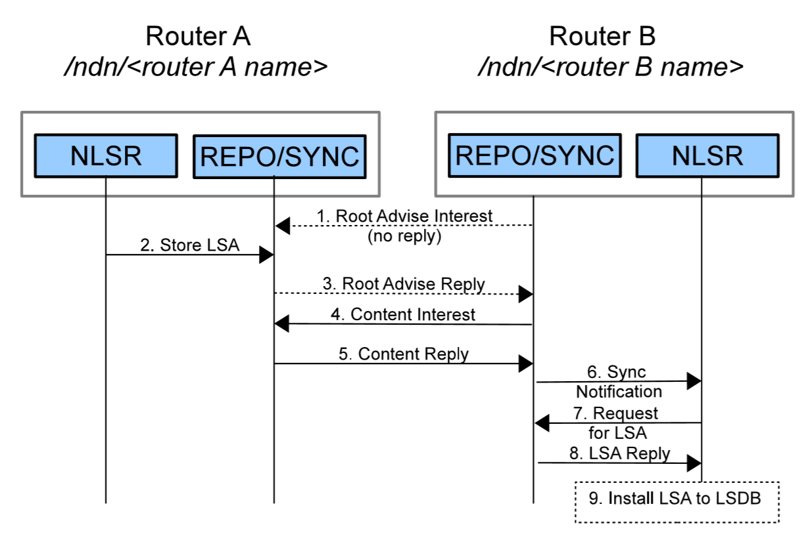
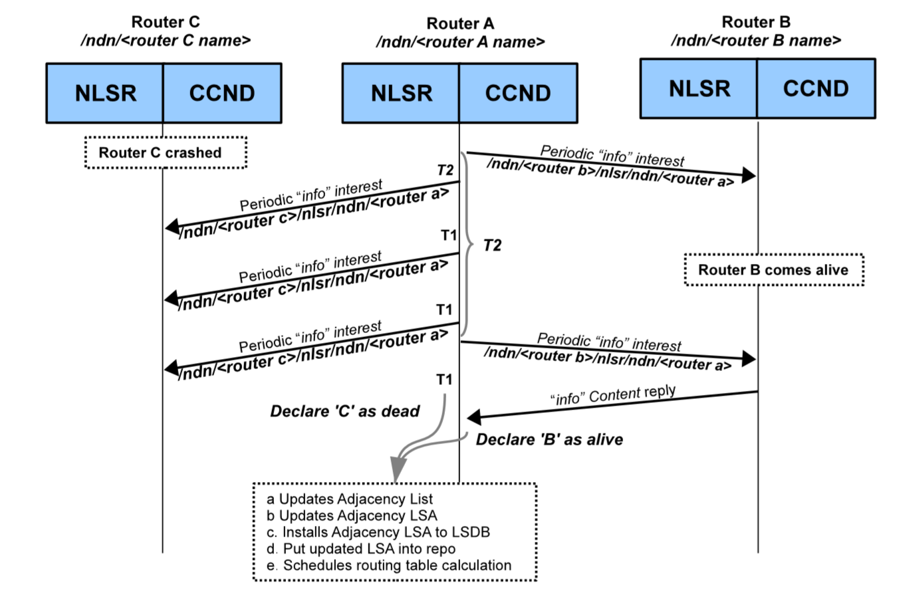
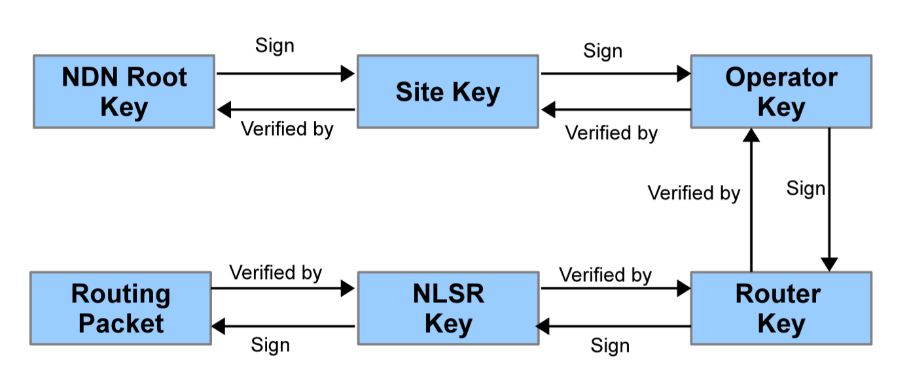
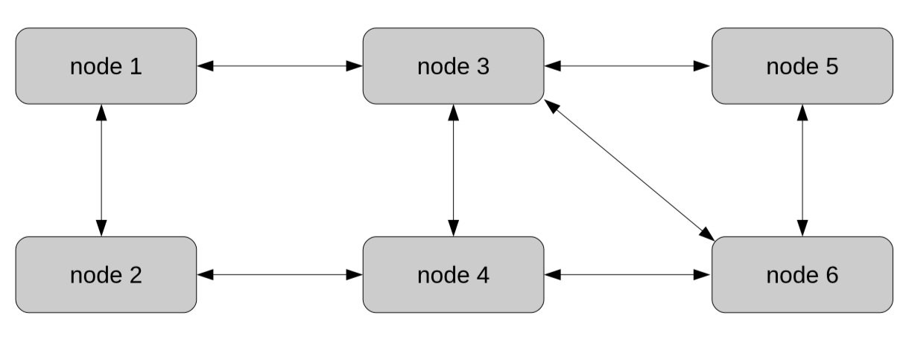
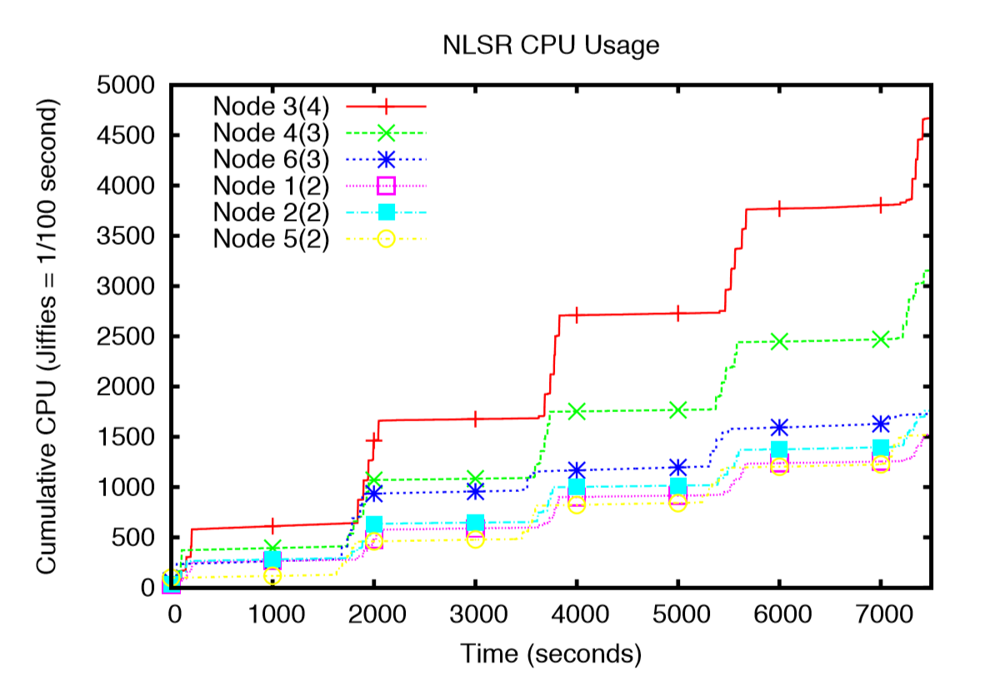
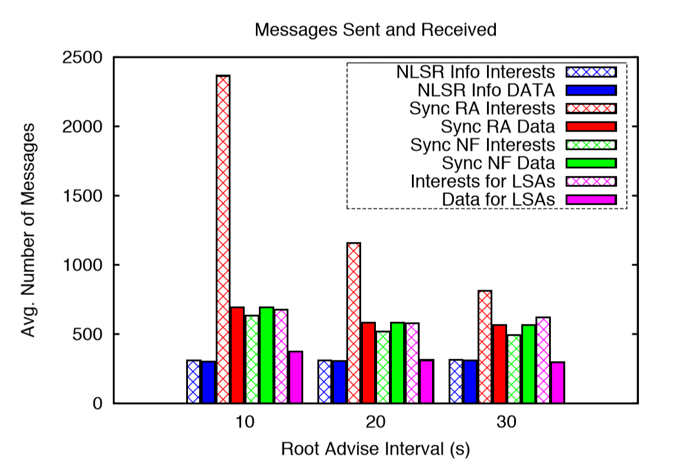
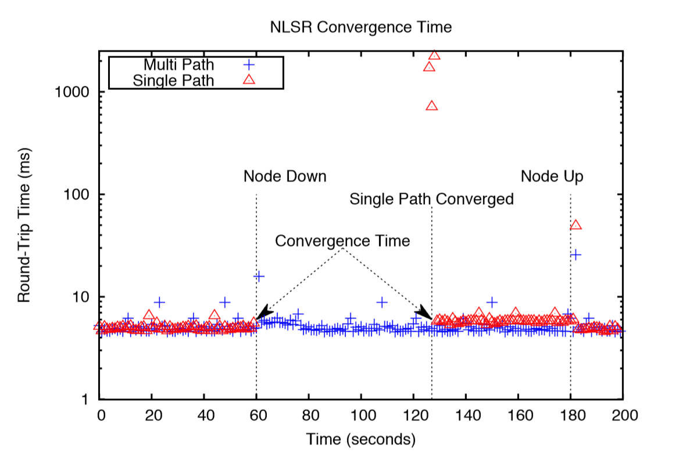

# NLSR: 命名数据链路状态路由协议

> paper地址：[NLSR: Named-data Link State Routing Protocol](https://named-data.net/wp-content/uploads/2013/07/nlsr-final.pdf)

## 摘要（Abstract）

本文介绍了一种用于命名数据网络（NDN， *Named Data Network*）的路由协议——命名数据链路状态路由协议（NLSR，*Named-data Link State Routing Protocol*）的设计。由于NDN使用名称来标识和检索数据，所以NLSR将可达性传播到名称前缀而不是IP前缀。此外，NLSR区别于基于IP的链路状态路由协议，有两个最基本的特征。首先，NLSR使用兴趣包（*Interest Packet*）和数据包（*Data Packet*）来传播路由更新，直接受益于NDN内生的数据包验证，更加安全；其次，NLSR为每一个名称前缀生成一个按**一定规则**（*比如，开销*）排好序的转发选项列表，给实现NDN自适应的转发策略做支撑。在本文中，我们将讨论NLSR主要设计思想，主要包括以下几个部分：

- 一个适用于路由器、安全密码（*keys，包括公私钥那些*）、和路由更新的层次化命名方案；

- 一个适用于单个管理域的层次化信任模型；
- 一个逐条同步协议，用于替代传统的使用网络泛洪的方式传播路由更新；
- 一个给多路径转发选项排序的简单算法。

与基于IP的链路状态路由协议相比，NLSR提供更高效的路由更新传播，拥有内建的路由更新认证而且原生支持多路径转发。

## 关键词（Keywords）

Routing, NDN, Trust Model

## 介绍（Introduction）

命名数据网络（NDN）[3, 4]是一种新型的网络体系结构，是对当前基于IP的Internet体系结构一次大刀阔斧的整改。NDN在每个包（*packet*）中都放置一个数据名称，而不是携带目标IP地址；数据的消费者发送一个兴趣包（*Interest packet*）来获取数据，兴趣包中包含了所要获取数据的名称标识，一个包含相同名字的数据包（*Data packet*）可以用来响应这个兴趣包（*Interest Packet*），数据包中包含名称、数据以及一个由最初的数据生产者生成的对该数据包的签名。通过给数据包进行显示的命名和签名，NDN网络支持一系列的特性，包括：网内缓存（ *in-network caching*）、多路径转发（*multipath forwarding*）、多播数据交付（*multicast data delivery*）和数据真实性校验（*data authenticity*）。

为了能使NDN在广域网（*wide-area networks*）上能很好的工作，一个NDN的路由协议需要计算并将合适的转发条目插入到NDN节点的FIB（*NDN网络的转发表*）表中。每个FIB表项包含一个名称前缀和一个或多个下一条出口记录，NDN可以根据FIB表信息来转发和FIB表项中名称前缀相匹配的兴趣包（*Interest packet*）。IP网络下的路由协议必须使用单一的最佳下一跳或者限制其转发到多个等成本的路径，来避免循环路径的产生，而NDN网络有内建的预防循环路径产生的机制，所以可以自由的利用多个路径。因此，**NDN网络需要一个能够支持基于名称进行多路径路由的路由协议**。

我们之前为NDN开发了一个**OSPFN** [8] 路由协议，它是OSPF路由协议的一个扩展版本，适用于NDN，并将其部署在NDN的测试床上。OSPFN定义了一种新的不透明的链路状态通告（LSA），用于在路由消息中携带名称前缀。它为每个名称前缀计算出最佳的下一跳，并插入到FIB表当中，网络管理员可以手动为OSPFN配置一个除了最佳下一跳以外的可选下一跳列表，并插入到FIB表中。虽然OSPFN可以构建基于名称前缀的FIB表，但同样存在很多限制。和传统的基于IP的路由协议一样，OSPFN仍然使用IP地址作为路由器的ID，依赖于GRE隧道来跨越传统的IP网络，并且对于每个名称前缀值计算一个最佳的下一跳。我们在部署OSPFN的过程中发现，管理IP地址和隧道是主要的操作问题，并且由于对多路径的支持不够，限制了NDN原有的优势（*内建的网内缓存和防路径循环机制等等*）。

在本文接下来的部分，我们将介绍命名数据链路状态路由协议（NLSR）的详细设计，并使其工作在NDN网络上（**换句话来说，NLSR使用NDN的兴趣包和数据包来交换路由消息**）。OSPFN是一种与OSPF类似的链路状态协议——链路状态通告（LSA）在整个网络中传播，每个路由器构建出了完整的网络拓扑。和OSPF有所区别的是，在OSPFN中，路由器不再只计算一条最短路径，而是对所有符合策略的下一跳进行排名，并按序写入FIB表当中，其在本质上提供了一个基于名称的多路径路由表，被用来作为NDN转发策略的输入（*NDN的可以利用多路径信息进行丰富的转发策略定制*）。

NLSR使用名称而不是IP地址来标识路由器和链接，因此它可以使用任何底层的通信渠道（*例如：以太网、IP隧道、TCP/UDP隧道等等*）来交换路由消息。**NLSR直接受益于NDN内建的数据认证机制**：由于每个路由更新消息都是由NDN数据包（*Data packet*）所携带的，并且NDN中每个数据包都带有数据生产者的签名，所以路由器可以通过验证每个路由消息的签名来保证它是由指定的原始路由器生成的，并且在传播过程中没有被篡改（***数据的完整性和有效性校验***）。

作为NDN上第一个分布式的路由协议，NLSR的设计需要回答以下几个在NDN上独有的问题：

- **命名**（*Naming*）：如何给**路由器**（*routers*）、**链接**（*links*）和**路由更新**（*routing updates*）命名？
- **信任**（*Trust*）：如何**分发路由器的加密密钥**（*cryptographic keys*），以及如何获得对这些密钥的信任
- **信息传播**（*Information Dissemination*）：如何**在网络中传播路由更新**？（*基于IP的路由协议采用推的方式将路由更新发送给其他路由器，而在NDN网络中则需要路由器主动去拉取所有更新*）
- **多路径**（*Multipath*）：如何产生并排序下一跳以促进多跳转发？

在本文中，我们描述了我们是如何选择我们的设计方案的，并且阐明了这些选择背后的基本原理。我们的目标不是发明一种新的路由方案（*因为在本质上来讲NLSR也是一种链路状态路由协议*），而是为了证明在NDN网络上建立一个路由协议的可行性和优势。

由于NDN的自适应多路径转发能够处理在转发平面上存在的多个数据包传递问题（*例如：环形路径*），使得路由平面的限制放宽了，设计可以更加自由。举例来说，路由协议将不用关心路由平面是否会产生环路，因为NDN的FIB表项的合并操作将使得环路的产生变得不可能。因此，一些原先在IP网络中不起作用的路由协议设计现在可以在NDN网络中使用，并且新型路由的设计也成为可能。探索其它类型的路由设计将是我们未来的工作之一。

本文接下来的部分将包含以下内容：第二节简要介绍了NDN网络所提供的一些基本的功能，第三节介绍了设计的细节，第四节展示了实验测量和结果，第五节讨论一些相关的工作，第六节将对全文进行总结。

## NDN的基本功能（NDN PRIMARY）

NDN在其转发平面 [3] 中有三个主要的组件：

- **转发信息库**（FIB，*Forwarding Information Base*）：FIB即为NDN网络中的转发表，用于存储转发条目，将兴趣包与**相匹配数据**（*与兴趣包名称相同的数据包*）的潜在来源相关联。与IP网络中的转发表不同的是，对于每一个名称前缀，他的传出端口（下一跳）不止一个，而是一个列表。FIB表中的表项可以手动插入，也可以利用NDN路由协议中的控制平面进行填充。
- **未决兴趣表**（PIT，*Pending Interest Table* ）：PIT表存储了未被满足的兴趣包以及他们到来的face接口，因此数据包可以通过查询PIT表项被路由回到原始的发送兴趣包的节点。
- **内容缓存**（CS，*Content Store*）：CS用来缓存数据。

当一个兴趣包到达路由器，路由器首先会检查`CS`中是否有相匹配的数据，如果有则将数据包从收到兴趣包的端口上转发出去，否则将其添加到PIT表当中（*同时记录下兴趣包的入口Face*）。如果PIT表中存在相同名称的条目，新的端口编号将被添加到端口列表当中，以便可以在数据包到来时向所有兴趣包到来的端口发送一个数据包的副本。最后，如果兴趣包是第一次插入PIT表中（*即 PIT表中不存在相同名字的兴趣包*），则该兴趣包将通过查询FIB表转发至下一跳，如果FIB条目中存在多个下一跳，则一个成为“转发策略”的模块将会决定在多条路径同时存在的情况下，该如何转发兴趣包。

## 设计（Design）

作为一种链路状态路由协议，NLSR通过分发链路状态通告（LSAs）来构建网络拓扑并分发名称前缀可达性。NLSR路由器建立并维护与邻接路由器的关系，每当它检测到任意链接的故障或恢复，或者是发现一个新的邻居，都会生成一个新的LSA并传播到整个网络当中。此外，NLSR路由器还会向全网通告本地静态配置的名称前缀和local的内容提供者动态注册的前缀。当任意的名称前缀被添加或者删除时，NLSR同样会生成一个新的LSA并将其传播到全网。最新版本的LSAs将会存储在链路状态数据库（LSDB，*Link State Data Base*）。

这种拓扑和可达性信息的分发方式最初看起来似乎有点过于直接了，因为在IP路由器中已经实现了类似的功能。然后，由于在NLSR中使用NDN的兴趣包和数据包来进行路由更新，路由协议的设计就必须对IP地址和IP数据推送等一些熟悉的概念（*例如：在IP网络中任何节点都可以简单的将任何数据包发送到任何其它的节点*）做一些转变。因此，我们需要根据数据的名称和数据的获取方式来思考我们的设计。更具体来说，我们需要一个针对路由器和路由更新的系统的命名方案（*3.1节详细介绍*）。同时，路由器需要在不知道其它路由器何时会产生新的路由更新的情况下迅速的拉取到最新的路由更新，因为网络拓扑和网络名称前缀随时可能发生更改（*而一旦网络拓扑或者名称前缀发生改变，就会产生新的路由更新*）。

在路由功能方面，NLSR与之前的链路状态路由协议主要有以下两个方面的不同：

- NLSR为每个名称前缀提供多个路由，而不是提供单个最短路径；
- NLSR对每个LSA都进行签名和验证，这样能保证每个路由器只产生自己的前缀和连接信息（*不能伪造*）

我们将在3.4节介绍我们的路径计算算法， 在3.6节介绍NLSR的信任模型。

作为开发基于NDN的路由协议的第一步，NLSR最初的设计运行在单个路由域中，并且只使用简单的单权限信任模型。我们现在正在将NLSR部署到我们的NDN测试床上，我们相信这一初步设计的部署经验可以为我们以后开发基于NDN的域间路由协议和设计域间路由的信任模型起到抛砖引玉的效果。

- ### 命名（Naming）

  也许我们设计中最重要的部分便是在路由系统中对每个元素及其相关的公钥设计一个合适的命名方案。基于我们现有网络的结构和操作经验，分层命名的方案可以很好的表示系统中各个组件的关系，还可以很容易区分路由器是否属于同一个网络，同时为给定的路由过程生成消息也变得简单。同样的，分层命名的方案还有利于将密钥和其拥有者关联起来。

  在我们的设计中，每个路由器的命名都是根据它所在的网络，所属的站点以及其所属站点为该路由器分配的名字组成的，即 `/<network>/<site>/<router>`。例如，一个位于亚特兰大（*Atlanta*）的一个PoP中的路由器的一个可能命名时这样子的：`/ATT/AtlantaPop1/router3`。以这种方式命名的话，如果两个路由器共享相同的名称前缀`/<network>`，则可以判断这两个路由器属于同一个网络下；如果两个路由器共享相同的名称前缀`/<network>/<site>`，则可以判断这个两个路由器属于同一个网络下的同一个站点。采用这种分层命名的方式，可以很容易的过滤出错误的路由消息。

  路由器上NLSR进程的名字时根据路由器的名称命名的，具体的就是路由器的名称作为前缀，后面跟上NLSR进程的名字`NLSR`，即`/<network>/<site>/<router>/NLSR`。这个路由进程名字用于在相邻NLSR路由器节点之间传递周期性的`info`消息，可以用来检测链接是否失败，以及检测NLSR进程本身的一些错误（*3.5节会详细介绍*）。

  在理想情况下，任何由NLSR进程产生的路由更新消息的命名都应该以该NLSR路由进程的名称作为前缀，这样就很容易可以辨别产生该消息的NLSR进程。换句话说，一个LSA的名称应该时类似这种格式的：`/<network>/<site>/<router>/NLSR/LSA`，这样可以标识该LSA是由指定的NLSR进程生成的。然而， 由于我们在实现的过程中使用了**CNNx** [5] 和 **Repo** [5] 来传播同步LSA消息，而 **CNNx repo** 严格限制了所有参与同步的消息都要共享相同的前缀，我们目前一个折衷的做法是所有路由器生成的LSA都共用一个前缀。我们为每个LSA使用相同的前缀`/<network>/NLSR/LSA`（*我们称之为 <LSA-prefix>*），并在此前缀后加上`/<site>/router`用以区分不同NLSR路由器生成的LSA。

- ### 链路状态通告（LSAs）

  NLSR设计了两种类型的LSA，分别是**邻接LSA**（*Adjacency LSA*）和**前缀LSA**（*Prefix LSA*），其中邻接LSA用于对外宣告一个NDN路由器与其所有邻居相连的活动的链路，而前缀LSA则用于对外宣告在当前的NDN路由器已经注册的名称前缀。他们所包含的内容如下表所示：

  
表 1  LSA所包含的内容

  | Type          | Content                                                      |
  | ------------- | ------------------------------------------------------------ |
  | Adjacency LSA | #Active Links (N), Neighbor 1 Name, Link 1 Cost, ...,Neighbor N Name, Link N Cost |
  | Prefix LSA    | isValid, Name Prefix                                          |
  
  一个**邻接LSA**（*Adjacency LSA*）的命名通常是这样的：`/<LSA-prefix>/<site>/<router>/LsType.1/<version>`，其中`<router>`指的是产生该LSA的路由器的名字，`<version>`指的是LSA的版本号（*这个版本号是随时间变化的，路由器每产生一个新的同类型的 LSA，版本号就会改变*），在目前的实现里，LSA的`<version>`使用的是LSA创建时的时间戳（实际上，和OSPF类似，用序列号来表示也是可以的）。如表1所示，**邻接LSA**包含了所有与当前路由器相连的处于激活状态的链接，每一项包含邻居路由器的名字，和链路开销（*link cost*）。它是在路由器启动的时候创建的，且每当路由器的链接状态发生改变时（*路由器的链接状态的改变是由周期性的 `info` 兴趣包检测到的，在3.5节会*），都会创建新的**邻接LSA**。
  
  一个**前缀LSA**（*Prefix LSA*）的命名通常是这样的：`/<LSA-prefix>/<site>/<router>/LsType.2/LsId.<ID>/<version>`，需要提一嘴的是，每个名称前缀都是使用单独的**前缀LSA**来向外通告的。由于一个路由器通常需要宣告多个前缀，所以我们在前缀LSA的命名中使用*ID*来标识不同前缀的LSA（前缀LSA的ID可以是手动配置的，也可以是基于要宣告的名称前缀计算得来的）。我们这样设计**前缀LSA**是有所考虑的，如果我们将所有的前缀都塞到单个LSA中进行传播可能会放不下，而且更新的效率不高（*因为每当有前缀添加或删除的时候就需要生成新的前缀 LSA，如果所有的前缀都用一个前缀 LSA来通告的话，就会传递很多冗余信息*）。每个**前缀LSA**包含一个*isValid*标记（初始时，*isValid* = 1）和要宣告的前缀名称。当一个名称前缀被取消注册时，NLSR会将对应的**前缀LSA**的*isValid*标记设置为0，并且将新的LSA传播给其它节点，其它的NLSR节点收到这个LSA会将这个名称前缀从LSDB中删除并且更新FIB表项中对应的表项。
  
  为了移除由于路由器故障来不及移除的过时的LSA，每个路由器会周期性的为每个要通告的前缀生成新版本的前缀LSA，而且每个LSA会有一个生存期（*lifetime*），一旦生存期失效，这个LSA就会被路由器从LSDB中移除。因此，一旦某个路由器发生故障奔溃，其之前通告的的LSA不会在其它路由器的LSDB中保存太长时间，会很快失效。路由器在计算路由时，不应该收到NLSR中过时的LSA的影响，一旦路由器奔溃，其邻居将会更新它们LSA的状态，这样网络流量就不会向通往这个奔溃路由器的无效链路上传送了。因为我们不使用刷新机制来处理丢包和包损坏（这些将由 *CNNx Sync* 处理），而且过期的LSA并不影响路由计算，因此刷新器的刷新间隔可以设置成较大的间隔，例如：可以每天刷新一次。
  
- ### LSDB 同步（*LSDB Synchronization*）

  为了从概念上简化我们的设计，我们将LSDB看作一个数据的集合，把LSA的传播问题看作由路由器维护的LSDBs的同步问题。路由器周期性地交换他们LSDB的hash值来检测不一致性，如果发现不一致则从不一致中恢复。这种逐跳的同步方法可以避免不需要的网络泛洪，当网络稳定时，邻居之间只需要相互交换LSDB的hash值即可，而不用互相传递所有的LSAs。此外，这种数据同步方式时接收方驱动的，这意味着路由器只会在具有CPU周期时去拉取LSAs，因此路由器基本不会被频繁的路由器更新整奔溃。

  我们当前的实现使用的是 *CNNx* 同步协议或 *Sync* [5] 来将LSAs传播到邻居路由器。*Sync*和*CNNx*的*Repo*相关联，它允许应用程序在*Repo*中定义命名数据集合，这个集合被称之为*slice*，并保持当前路由器与相邻路由器中定义相同的*slice*的同步。*Sync*会为*Slice*中所有的数据计算一个Hash树，并且在相邻路由器之间交换根Hash的值来检测不一致性。如何检测到Hash值不一致，则两个邻居节点会交换Hash树下一层节点的Hash值，直到他们检测到导致不一致性的叶子节点，两个邻居路由器就会交换对应的数据来达成新的一致性。

  
  
图1 路由器之间使用 CNNx Sync/repo 相互传播LSA示意图（图中虚线代表周期性消息）

  上图1显示了LSA是如何在网络中传播的：
  
- 为了同步包含*LSAs*的*Slice*，*Sync*协议（*路由器B*）周期性的对外发送被称为*Root Advise*的特殊兴趣包，这个兴趣包携带了发送路由器的*Slice*的hash值（***步骤 1***）；
  
- 当路由器A创建了一个LSA，并把它写入到*Sync*的*Slice*当中（***步骤 2***），此时路由器A计算的Hash值与路由器B的不同；
  
- 这将导致路由器A的*Sync*回复路由器B的 *Root Advise*（**通常，在两个路由器计算得到的hash值相同的情况下，是不需要回复 *Root Advise* 的，当路由器有有新的LSA产生或者移除时会导致路由器的Hash值不一致，此时才需要回复 *Root Advise***），这个回复中携带了路由器A本地计算得到的新的Hash值；（***步骤3***）
  
- 收到回复后，路由器B的 *Sync* 会比对收到的Hash值，并递归的获取到Hash树下一层级的Hash值，直到定位到导致不一致性的叶子节点，最终，路由器B的 *Sync* 会识别出需要同步的数据（*这里所说的数据即为 NLSR 语境下的 LSA*），并发送对应的兴趣包将需要同步的数据从路由器A中拉取过来（***步骤 4 和 5***）；
    - 接着，路由器B的 *Sync* 会将新收到的数据名字发给本地的NLSR进行（***步骤 6***）
    - 然后路由器B的NLSR进程就会发送对应名字的兴趣包给本地的 *repo* 来拉取同步过来的LSA数据（***步骤 7 和 8***），最后更新到本地的LSDB当中（***步骤 9***）。

每个 *Root Advise* 兴趣包都有一个存活期（*lifetime*），路由器在 *Root Advise* 兴趣包到期后会发送一个新的 *Root Advise* 兴趣包。这种周期性传输机制的设计是为了防止 *Root Advise* 兴趣包丢包的发生（*试设想，如果Root Advise 兴趣包的存活期无限大，会一直等待回复，如果 Root Advise 兴趣包在传输的过程中丢失了，而发送方又不知道，且不重传，那么发送方会以为没有新的更新，一直不去拉取最新的更新*），从而降低由于丢包带来的路由收敛延迟。但是，如果数据包的丢失率很低，频繁的发送 *Root Advise* 兴趣包亦会带来无意义的额外开销。在理想情况下，我们希望根据路由需求和网络特性来调整 *Root Advise* 兴趣包的发送频率。为了支持这个特性并解决 *CNNx Sync* 实现中的一些其它问题，我们正在致力于开发内建有同步机制的新版本的NLSR，以实现相同的LSA逐跳传播的效果。

- ### 多路径计算（Multipath Calculation）

  基于 **邻接LSAs**（*Adjacency LSAs*）提供的网络节点间的连接信息，每个NLSR节点都能构建出完整的网络拓扑。接着路由器只需运行一个简单的扩展 *Dijkstra* 算法便可以为每一个目的节点计算出多跳路由。从 **前缀LSAs**（*Prefix LSAs*）中，我们可以知道每个路由器都关联了哪些前缀。我们可以综合上述的信息计算出到达每个名称前缀的下一跳列表。

  我们设计的NLSR中某个路由器计算多路径路由的方式如下：

  - 首先路由器移除（并非断开，只是排除）到除了一个邻居外的其它直接相连的邻居的路径（即，只保留一个直接相连的邻居）；
  - 然后使用 *Dijstra* 算法计算计算当前路由器到网络拓扑中其它所有节点的开销，并记录；
  - 接着对每一个邻居都重复上述过程；
  - 最后路由器到网络上任意的其它节点都会有多条路径，并且每条路径都有一个开销，然后根据开销进行排名，就能得到到每个目的地的排好序的下一跳列表。

  需要提一嘴的是，NLSR支持让用户自行配置对某个名称前缀最多能有几条路劲插入到FIB当中，这样当路由器的邻居很多的情况下FIB表的大小也是可控的。但是计算开销仍然会随着 *Face* 接口数量的增加而增加，因为我们需要遍历所有的 *Face* 接口来找到所有可能的路径。我们计划探索其它多路径计算算法来解决这个问题。

  与IP不同的是，NDN中的路由信息仅作为转发平面的提示信息（*参考信息*），转发平面可以根据PIT表中维持的状态来观察数据交付的性能，然后结合实际观测值和来自路由协议排名信息来对每个名称前缀的多条路径进行排序。即便如此，路由协议中的排名信息对于初始时将一个兴趣包转发到指定前缀以及在当前路由无法检索数据时用于探索别的可用路由都是非常重要的。

- ### 故障与恢复检测（Failure and Recovery Detection）

  NLSR通过周期性的向每个邻居节点发送 `info` 兴趣包来检测链路故障和远端的NLSR进程故障，如果 `info` 兴趣包超时了，则NLSR会在较短的间隔内多次发送 `info` 兴趣包，这样可以防止 `info` 兴趣包丢包带来的影响。如果在此期间（*这个时间包含`info`兴趣包超时后的若干次重传时间*）邻居节点没有响应，则NLSR会将这个邻居节点的状态判别为 *down* ，与该邻居节点相连的链路也标记为链路故障。检测到故障之后，NLSR仍然会向故障邻居发送 `info` 兴趣包来检测故障是否恢复，但此时发送 `info` 兴趣包的时间间隔应该相对长一点，避免由于长期故障导致较大的无用开销。需要注意的是，检测到故障时NLSR时无法区分是链路的故障还是远端NLSR进程的故障，但是无论是哪种故障发生，故障链路都不会用于传输数据，所以在目前的设计里不区分这两种故障也无伤大雅。

  当邻居节点从故障中恢复时，NLSR会收到对 `info` 兴趣包的恢复，接着NLSR便会将该邻居的状态标记为 *Active* 。这个操作会导致 **邻接LSA** 的更新（*产生新版本的邻接 LSA*），并将新的**邻接LSA**传播到网络中，并准备启动路由表计算任务。下图2展示了节点A是如何检测到节点C的故障，以及时如何检测到节点B从故障中恢复的。

  

  
图2 邻居故障和恢复检测

- ### 安全（Security）

  每个NDN的数据包（*Data Packet*）都是经过数字签名的，并且生成的数字签名是数据包组成数据包的一部分。签名包含名字、内容和少量对签名验证有用的支持数据 [3] ，支持数据中很重要的一部分是`key locator` [1, 3]，它指示了用于给这个数据包签名的 `key` 的名称，这样接收者就能通过这个名称去拉取到给这个数据包签名的 `key`（*当然我们只能拉取到公钥或证书，不能拉取到私钥*），进而验证这个数据包的签名。

  一个**具有有效签名的LSA**（*即，这个 LSA的签名是验证通过的*）仅仅说明了这个LSA的签名是由其 `key locator` 域指向的 `key` 的**私钥**签名的，它并没有告诉我们拥有这个 `key` 的路由器是否能合法的生成LSA。举个例子来说，攻击者可以使用其私钥签名一个 **前缀LSA**（*Prefix LSA*），并将该LSA注入到路由系统中（*此时该 LSA的签名验证是可以通过的，但是实际上这个LSA不是一个合法的 LSA*）。为了检测签名信息的有效性，我们需要验证此LSA是否是由授权的NLSR进程签名的，换句话说，我们需要验证 `key` 的名字中包含的相关的NLSR进程是授权的。即便如此，攻击者还是可以使用与某个有效 `key` 相同的名字的包，塞入攻击者自己的`key`。所以，我们需要一个信任模型来验证 `key` 的有效性。

  NLSR是一个**域内路由协议**（*intra-domain routing protocol*），在单个网络域中，通常会有一个网络管理员（*信任锚*）可以验证网络中 `keys` 的真实性。因此我们将这个信任锚用于给网络中的 `key` 进行签名和验证，这样做易于构建和管理。我们可以简单的让信任锚对所有路由器的公钥进行签名，但实际上用一个 `key` 来对大量的 `key` 签名是存在很大的安全风险的。为了解决这个问题，我们在信任锚上设计了一个划分5个等级的层级结构，它将信任锚中 `key` 的签名职责限制到一个较小的范围。表2展示了每个等级 `key` 的命名，需要注意的是，所有 `key` 名称的最后一个组件（*component*）都是这个 `key` 的hash值（在表中未展示出来），所以当某个路由器发送兴趣包拉取一个 `key` 时， 总能保证拉取到的 `key` 是和名称所匹配的。

  
表 2  Keys Names

  | Key Owner | Key Name                                              |
  | --------- | ----------------------------------------------------- |
  | Root      | /\<network>/keys                                      |
  | Site      | /\<network>/keys/\<site>                              |
  | Operator  | /\<network>/keys/\<site>/%C1.O.N.Start/\<operator>    |
  | Router    | /\<network>/keys/\<site>/%C1.O.R.Start/\<router>      |
  | NLSR      | /\<network>/keys/\<site>/%C1.O.R.Start/\<router>/NLSR |
  
  首先在顶层的是 `Root key`，为当前网络的管理员所拥有，第二层包含一系列的 `site keys`，由网络中某个网站的管理员所拥有，并且使用 `Root key` 进行签名的。每个 `site key` 可以签名一系列的 `operator keys`（*通常一个网站由多个操作员*），每个 `operator key` 又能签名一系列的 `router keys`，每个 `router key` 又能给运行在同一个路由器上的NLSR进程签名NLSR使用的 `key`，最后，路由器使用 `NLSR key` 给每个由NLSR生成的数据签名。需要注意的是，我们目前的设计里使用 *CNNx sync/repo* 来传播 `keys`，所以所有的 `keys` 都共享一个同一个前缀 `/<network>/keys` （*前文中有提到过这是 CNNx 机制限制的，所有用于同步的数据都需要共享同一个相同的前缀*），但是我们现在设计的 `keys` 命名方案确实是一个层级的结构。此外，我们使用两个标记 `%C1.O.N.Start` 和 `%C1.O.R.Start` 来分别指示 `operator keys` 和 `router keys`。
  
  
图 3  每个NLSR包的签名和认证链

  NLSR严格执行基于信任锚的信任模型，图3描绘了每个NLSR包的签名和认证的流程。当NLSR路由器发送一个LSA到网络中时，它会使用它的 `NLSR key` 对数据包进行签名，并把用来签名的 `NLSR key` 的名字放在数据包（*Data Packet*）的 `SignedInfo/KeyLocator/KeyName` 域里面。每当收到一个LSA，NLSR路由器会从本地的内容缓存（*content store*）或者 `repo` （*key 可能已经通过 `key` repo 进行分发* ）中获取包中指定的 `key`，并验证内容的签名，同时NLSR会检查这 *key* 是否确实属于生成LSA的那个NLSR进程。接着重复上述过程，直到NLSR拉取到信任锚的自签 `key`。如果在这个过程中任意一步的 `key` 拉取失败，或者NLSR发现拉取到的 `key` 是由一个未授权的 `key` 签名的，亦或是最后的验证步骤没有到达信任锚，都认为该LSA是非法的。需要注意的是，一旦一个 `key` 被验证有效了，我们将记录这个信息，以后再收到由该 `key` 签名的数据包时，不需要再对这个 `key` 进行重复验证。

## 评估（EVALUATION）

本节我们将就处理时间、消息传递开销v 和收敛时间三个方面评估NLSR的性能。所有的测试在六个具有不同操作系统和系统规格的异构节点组成的网络上进行，具体的网络拓扑如图4所示。需要特别说明的是，我们为了在短时间内对协议进行测试，我们将刷新时间设置为30分钟，而不是几天。

图 4  网络拓扑

图 5  每个节点上NLSR进程的CPU的利用率

图5展示了每个节点上NLSR进程的CPU利用率，图中节点名称后括号内的数字代表该节点的度数（*即该节点邻居的个数*）。从图中可以看出，具有较高连通性的节点的CPU占用率较高，换句话说，在同一个节点上，计算量随链接数的增加而增加。这是因为在每个链路上都需要运行*Dijstra*算法计算最短路径（*在 3.4 节有详细的介绍*），这会带来更高的消息传递开销和更多的路由计算。

图 6  平均CPU利用率

图6展示了在使用和未使用信任模型时NLSR的处理开销对比。从图中可以看出，即便使用了信任模型，需要使用多级的 `key` 来进行签名和验证，NLSR也几乎不会产生太多额外的开销。这是因为实际上，NDN网络本来就需要对所有传出的数据包进行签名，使用信任模型只是多了验证的步骤，验证过程需要更多时间去本地的存储库中递归获取多个 `key` 并执行验证。然后，由于这些都是本地操作（*作者的实验环境中，`keys` 应该时提前分发到每个节点上的，每个节点只需要去本地的 `key repo` 就能拉取到需要的 `key`* ）而且只有需要新的 `key` 时才会去递归验证，已经验证的 `key` 可以反复使用，所以这只需要较低的开销。图6还展示了，与使用单路径路由相比，使用多路径路由会占用更多的CPU。由于两种方案的消息传递开销时相同的，这种差异的原因主要是多路径路由计算的时候需要对每个邻居计算一次然后合并，计算成本比较高。

图 7  数据包发送和接收的数量

图7展示了每个节点平均的消息传递开销，我们分别设置 `Sync` 的 `Root Advise` （*RA*）消息的存活时间为10 ~ 30秒（*默认为 20 秒*），图中数字描述的是每个节点的 *NLSR* 和 *Sync* 平均发送的兴趣包的数量和接收到对应数据包的数量。NLSR进程只发送 `info` 兴趣包，这个和 `Root Advise` （*RA*）的存活期长短是无关的，所以在只改变 *RA* 消息的存活期长短的情况下，NLSR发送的 `info` 兴趣包的数量是不变的。`Sync` 产生的兴趣包主要是 *RA* 兴趣包，*RA* 兴趣包是周期性发送的，但是只有在hash值不一致时才会收到回复，因此 *RA* 兴趣包的数量会高于 *RA* 回复包的数量。正如预期的一样，设置较长的发送 *RA* 兴趣包的时间间隔，*RA* 兴趣包的发送数量会降低。`Sync` 除了发送 *RA* 兴趣包之外，还会发送 **节点拉取**（*NF*）兴趣包，来获取 `Sync` 树上的节点。*NF* 包带来的消息传递开销比 *RA* 包的要小，尤其是当网络比较稳定的时候。拉取 *LSA* 的兴趣包是向所有的端口广播的，但是只有拥有该缺失的 *LSA* 的邻居会回复，所以 *LSA* 兴趣包的数量要高于 *LSA* 数据包的数量。

图 8  使用和不使用多路径的情况下的收敛时间

在测试收敛时间时也是用和上面一样的网络拓扑，在启动所有的节点后，等待足够的时间，使得所有节点的 *LSDBs* 相互保持同步。当网络收敛后，我们使用 *ccnping* 工具 [7] 来生成网络流量。*ccnping* 服务器放置在 *node6* 上，在 *node2* 上启动 ccnping 客户端发送 *ccnping* 兴趣包（*ping*），设置超时时间为4秒。在60秒后，我们手动关闭 *node4*，这将强制 *node2* 换一条路径去访问 *node6* 上的服务。图8展示了使用多路径路由的好处：*node2* 不需要重新计算路径，它只需要在检测到 *node4* 故障时简单切换到另一条可用的路径即可。相比之下，只使用单路径路由花费了大概1分钟的时间才找到新的可用路径，并且在180秒重新启动 `node4`时回到原来的路径。收敛的时间可以通过 `info` 兴趣包的超时时间以及重试次数来控制，默认情况下，超时时间为60秒，在将节点或者链接声明为`down`之前的重试次数为3（*间隔 15秒*）。

## 相关工作（Related Work）

据我们所知，在NDN网络的路由领域只有非常有限的相关工作。Dai 等人提出的路由协议 [2] 表面上与NLSR类似，但还是与NLSR存在以下几个方面的不同：

- 首先，他们使用 OSPF 收集网络拓扑信息并计算最短路径，而我们使用 *Sync* 传输 LSAs，而不是用泛洪的方式；
- 其次，他们的路由消息不是作为兴趣包/数据包发送的，因此无法享受签名更新的好处（即安全性）；
- 最后，他们的多路径转发仅限于由多个生产者提供的内容，例如：在多个服务器副本中进行任播，虽然我们也支持这种情况，但是我们也支持同一生产者的多个路径。

在 [6]，作者提出了一种在NDN中基于控制器的路由方案（*CRoS*）。控制器存储网络拓扑，计算路由，并存储命名数据的位置，以便他们可以给网络中任何的命名数据安装路由。虽然这种使用分散控制器的想法很有趣，但是网络仍然需要泛洪特殊格式的兴趣包用来检索控制器，这会带来巨大的开销。

## 结论（Conclution）

虽然基于IP网络的链路状态的路由协议设计是一个被研究的很透彻的一个话题，但是我们设计NLSR的过程也是一个很棒的学习经历。为了满足NDN的路由要求，NLSR脱离了常规的路由协议使用单路径的方法，而是为每个名称前缀提供多个转发选项。

我们从这次实践中获得的主要收获是NLSR作为一个在NDN上开发应用程序的具体方案，它要求：

- 仔细考虑命名空间的设计；
- 一个用于验证的信任模型的开发；
- 使用兴趣包/数据包交换来实现路由消息的更新这一NDN新的设计模式的调整。

此外，使用命名数据通信也可以实现同步，这促进了分布式系统中的数据集同步。我们的NLSR设计中使用 *Sync* 来使得路由协议更加健壮，而且在概念上更加简单。

迄今为止我们的研究成果意味着我们迈向了基于NDN的路由系统开发的第一步，我们正在进行的工作包括实际部署和操作、探索新的路由方案并扩展到域间路由。

## 引用（Reference）

[1] C. Bian, Z. Zhu, E. Uzun, and L. Zhang. Deploying key management on NDN testbed. Technical Report NDN-0009, Febryary 2013. 

[2] H. Dai, J. Lu, Y. Wang, and B. Liu. A two-layer intra-domain routing scheme for Named Data Networking. Globecom 2012 - Next Generation Networking and Internet Symposium , December 2012. 

[3] V. Jacobson, D. K. Smetters, J. D. Thornton, M. F. Plass, N. H. Briggs, and R. L. Braynard. Networking named content. In Proceedings of ACMCoNEXT, 2009. 

[4] L. Zhang et al. Named data networking (NDN) project. Technical Report NDN-0001, PARC, October 2010. 

[5] PARC.CCNx open srouce platform. http://www.ccnx.org. 

[6] J. Torres, L. Ferraz, and O. Duarte. Controller-based routing scheme for Named DataNetwork. Technical report, Electrical Engineering Program, COPPE/UFRJ,December 2012. 

[7] University Of Arizona. ccnping. https://github.com/NDN-Routing/ccnping. 

[8] L. Wang, A. M. Hoque, C. Yi, A. Alyyan, and B. Zhang. OSPFN:An OSPFbased routing protocol for Named Data Networking. Technical Report NDN-0003, July 2012. 

[9] C. Yi, A. Afanasyev, L. Wang, B. Zhang, and L. Zhang. Adaptive forwarding in named data networking. SIGCOMM Comput. Commun. Rev., 42(3):62–67, June 2012.